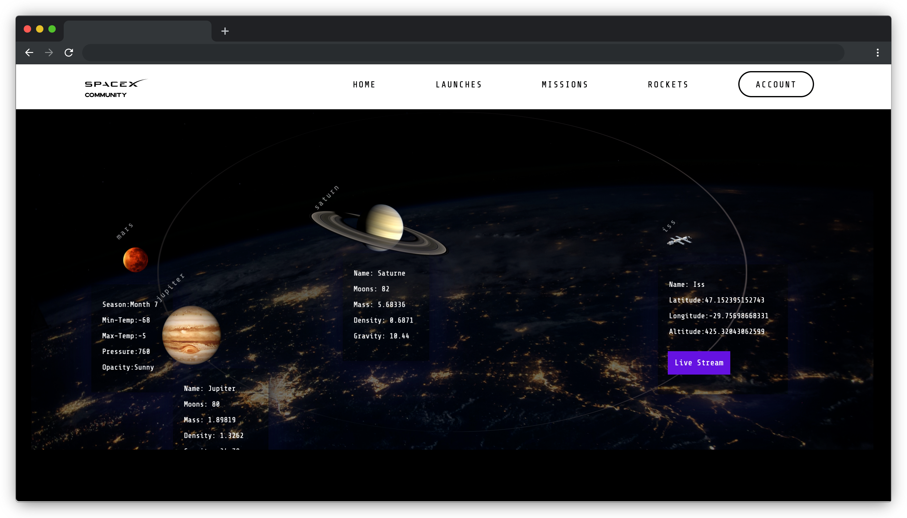

# Project Exam 1


this project was about implementing use of javascript and api in fetching external data , we were requested to chose between either nasa api website topic or spacex topic.

## Description

this project was a good implementation of use of javascrip and api calls, i fetched a lot of data from spacex api open source websites with no need for identifications of keys.
this website is a spacex community website, where users could gather to get information about rockets, launches, next launches and past of space x space rocket company.

- a general view about the company feel and look and purpose
- presentation of space x fleet throw data and images
- timeline of development of space x throw time since 2002
- past of future launches of space x with details regarding the rocket type and mission date and payload and so on
  i took in consideration that this could be a place for passionate space rocket, space exploration , planetary exploration enthusiasts, rockets and science students or fans

- im a huge fan of space x, astronomy and planetary exploration, so it was easy and obvious to put myself as a typical user .
- as a user i would like to get the feel of the website, i made a welcoming, planetary-earth approach bakcground image with animations that could a good sensation for a new user.
- as a user i would like to see spacex rockets , so i gathered all in a slider, with fetched data for different api urls.
- as a user i would like to see the next and previous launches, so all is presented in slider, for past i limited the number, otherwise this could be overwhelming.
- a timer for next launch gives more excitement .

- as a user i would like to check the website from different devices, this website is responsive.
- a login form and creating account form and recovery password form are available.
- i used little colors that matches the purpose and use of the website.

## Built With

You can list a the tech stack that you've used over here

- [HTML]
- [css]
- [API]

## Getting Started

### Installing

no installation is required, as data is fetched from outside source via a non authentication process.

1. Clone the repo:

```bash
https://github.com/lacdart2/project-exam1_lakhdar-hafsi.git
```

2. Install the dependencies:

```
npm install
```

### Running

runs at once with no installation

## Contact

This is where you can leave your social links for people to contact you, such as a LinkedIn profile or Twitter link e.g.

[My Twitter page](https://twitter.com/LakhdarKader)

[My LinkedIn page](https://www.linkedin.com/in/lakhdar-hafsi-24b31060/)

## Acknowledgments

- open source space x apis
- www.spacex.com
